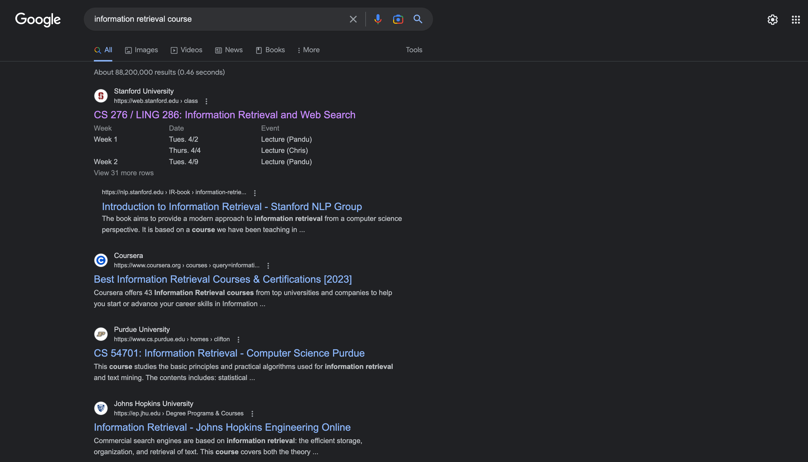
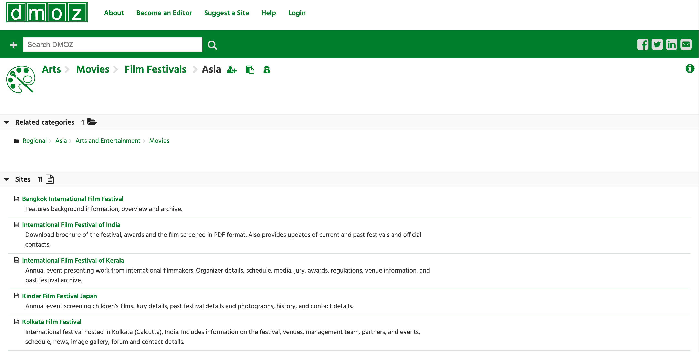
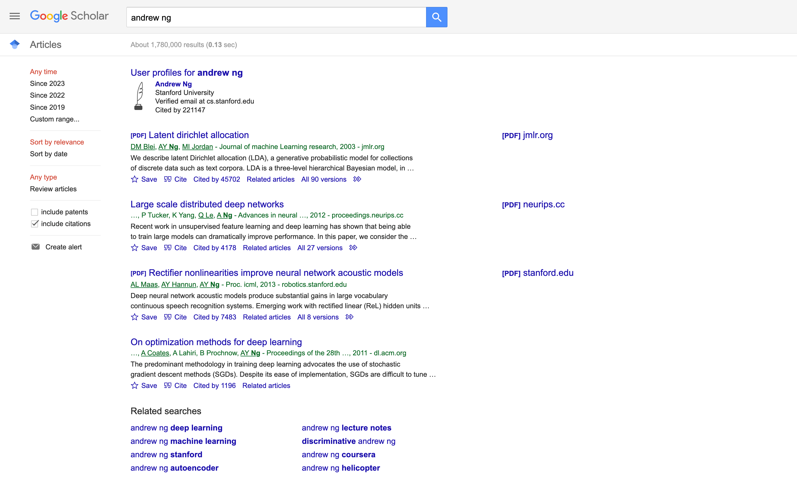

# Assignment 0
Examples of *search engines*.

## Some search engines work based on *automatic indexing* processes.

    

**[Google](https://google.com/)**  
Once a website is created, Google's indexing process automatically analyzes the website's content, including text, images and other media. Google then indexes the website content and stores it in a database.

When a user enters a search query into the Google search engine, its algorithms scan the index to find the most relevant results. The algorithm considers factors such as the user's search terms, page rank, etc.  
**Screenshot:**
  

## Some search engines work based on databases created by experts. These databases are called *Web Directory*.

   

**[DMOZ](https://dmoz-odp.org/)**   
In web directory, search engine categorizes websites into different topics and subtopics. The categorization is done by a team of experts who review and evaluate websites based on their content, relevance, and quality. Once a website is approved, it is added to the relevant category in the directory.

When a user enters a search query, the search engine searches through its database of categorized websites to find the most relevant results. The search results are displayed in a hierarchical format, with the most relevant categories and subcategories displayed first.   
**Screenshot:**
   

> **_NOTE:_** Unlike automatic indexing processes used by search engines like Google, web directories rely on human experts to evaluate and categorize websites.

## Some search engines are designed for a specific field.

    

**[Google Scholar](https://scholar.google.com/)**  
Google Scholar is a search engine that focuses on academic literature, including articles, theses, books, and conference papers. Google Scholar uses automatic indexing processes to create its database, which includes both open access and subscription-based content. Users can search for specific articles, authors, or topics, and can also create alerts for new publications in their areas of interest.   
**Screenshot:**
  